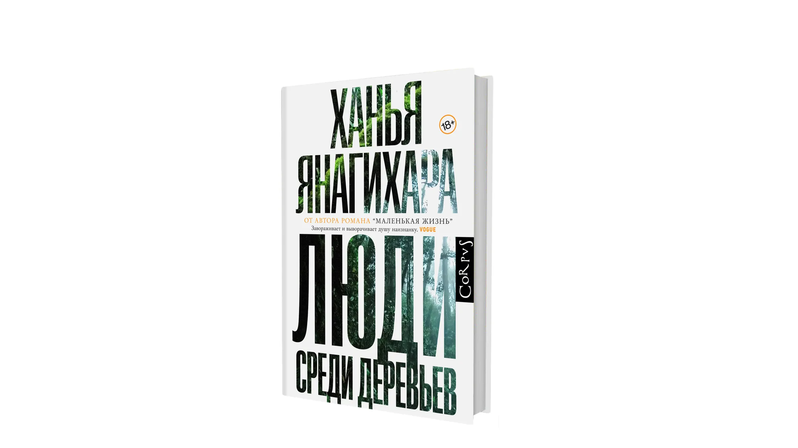

# Люди среди деревьев

<figure><figcaption></figcaption></figure>

Несколько лет назад я прочитал «Маленькую жизнь» Ханьи Янагихары. Читалось медленно, порой затянуто, но эмоциональное воздействие от книги было серьезным. Травмы, которые мы получили в детстве никуда не исчезают, какой бы любовью и добротой мы не были окружены. И вот теперь я закончил первую книгу Ханьи «Люди среди деревьев». Насилие в этой книге, в отличие от «Маленькой жизни», окружено знаками вопросов. В этих конкретных условиях это тоже насилие? А если все, кто участвуют в насилии, не считают это насилием, это тоже насилие? Еще исследуются пути науки на границе нравственности: можно ли ради науки разрушить что-то хрупкое и уникальное?

В общем я бы сказал, что «Маленькая жизнь» сильнее, чем «Люди среди деревьев». А концовка меня даже разочаровала. Не могу сказать, что она банальная, но она делает эту драму  детективом, в котором ты узнаешь имя убийцы в последнем абзаце.
