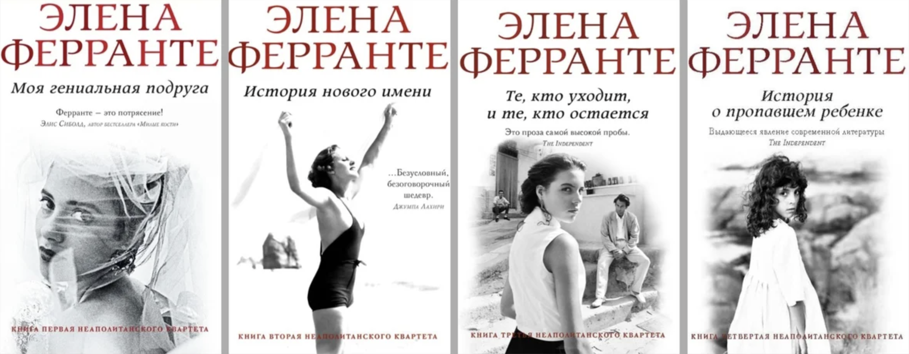

# Моя гениальная подруга

Тот случай, когда я читаю книгу после [сериала](https://www.imdb.com/title/tt7278862/) и получаю от этого удовольствие, потому что визуализирую героев и их быт. Гениальный сериал. А теперь еще герои раскрываются по-новому. Наконец, я могу объяснить их поступки.

Не выдержал и включил заново первую серию первого сезона. Точно, красиво, атмосферно.

